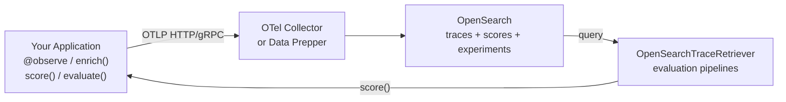

The OpenSearch AI Observability SDKs instrument LLM applications using standard OpenTelemetry. They handle the gap that general-purpose OTel doesn't cover: tracing your own agent logic — the orchestration, agents, and tools that sit above raw LLM calls — and submitting evaluation scores back through the same pipeline.

The SDKs are thin wrappers. They do not replace OpenTelemetry, they configure it. Remove a decorator and your code still works unchanged.

## What the SDK covers

**Pipeline setup** — one call (`register()`) creates a `TracerProvider`, wires up an OTLP exporter, and activates auto-instrumentation for any installed LLM library instrumentors (OpenAI, Anthropic, Bedrock, LangChain, and more).

**Application tracing** — the `observe()` primitive (Python) or wrapper functions (JavaScript) produce OTEL spans with [GenAI semantic convention](https://opentelemetry.io/docs/specs/semconv/gen-ai/) attributes. Use the `op` parameter to set the operation type:

| Operation | Use for |
|---|---|
| `invoke_agent` | Agent invocations and orchestration |
| `execute_tool` | Tool/function calls by an agent |
| `chat` | LLM chat completions |
| `retrieval` | RAG retrieval operations |
| `embeddings` | Embedding generation |

**Span enrichment** — `enrich()` adds GenAI attributes (model, tokens, provider, session ID) to the active span without manual `set_attribute()` calls.

**Evaluation scoring** — `score()` emits evaluation metrics as OTEL spans at span or trace level. No separate client or index needed — scores travel through the same OTLP pipeline as traces.

**Experiments** — `evaluate()` runs a task against a dataset with scorer functions, recording everything as OTel spans. `Experiment` uploads pre-computed results from any evaluation framework.

**Trace retrieval** — `OpenSearchTraceRetriever` queries stored traces from OpenSearch for building evaluation pipelines.

**AWS support** — built-in SigV4 signing for OpenSearch Ingestion (OSIS) and OpenSearch Service endpoints via `AWSSigV4OTLPExporter`.

## Architecture

The SDK configures a `BatchSpanProcessor` that exports in the background — your application code is never blocked waiting on network I/O.

## Available SDKs

- [Python SDK](/docs/sdks/python/) — `opensearch-genai-observability-sdk-py` on PyPI
- [JavaScript / TypeScript SDK](/docs/sdks/javascript/) — `opensearch-genai-sdk` on npm

## Related links

- [Agent Traces](/docs/investigate/discover-traces/) — viewing traces in OpenSearch Dashboards
- [Send Data](/docs/send-data/) — OTLP pipeline setup and collector configuration
- [GenAI semantic conventions](https://opentelemetry.io/docs/specs/semconv/gen-ai/) — the OTel spec the SDKs follow
