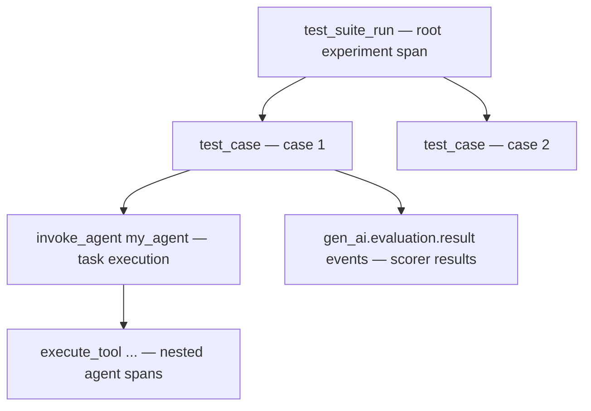

import { Aside } from '@astrojs/starlight/components';

The SDK provides two ways to run experiments:

- **`evaluate()`** — a built-in runner that executes a task against a dataset, runs scorer functions, and records everything as OTel spans.
- **`Experiment`** — a class for uploading pre-computed evaluation results from any framework (RAGAS, DeepEval, pytest, custom).

Both produce the same OTel span structure, so results appear identically in OpenSearch.

## `evaluate()` — built-in runner

Runs a task function against each item in a dataset, applies scorer functions, and emits experiment spans.

```python
from opensearch_genai_observability_sdk_py import register, observe, evaluate, Op, Score

register(service_name="my-eval")

@observe(op=Op.INVOKE_AGENT, name="my_agent")
def my_agent(input: str) -> str:
    # your agent logic here
    return f"Answer to: {input}"

def relevance_scorer(input, output, expected) -> Score:
    is_relevant = expected.lower() in output.lower()
    return Score(
        name="relevance",
        value=1.0 if is_relevant else 0.0,
        label="relevant" if is_relevant else "irrelevant",
        explanation=f"Output {'contains' if is_relevant else 'missing'} expected content",
    )

result = evaluate(
    name="my_agent_v1_eval",
    task=my_agent,
    data=[
        {"input": "What is Python?", "expected": "programming language"},
        {"input": "What is OpenSearch?", "expected": "search engine"},
    ],
    scores=[relevance_scorer],
    metadata={"agent_version": "v1"},
)

print(result.summary)
```

### Parameters

| Parameter | Type | Description |
|---|---|---|
| `name` | `str` | Experiment name. Stored as `test.suite.name`. |
| `task` | `Callable` | Function that takes an input and returns an output. Should be `@observe`-decorated for full tracing. |
| `data` | `list[dict]` | List of test cases. Each dict has `"input"` (required), `"expected"` (optional), `"case_id"` (optional), `"case_name"` (optional). |
| `scores` | `list[Callable]` | Scorer functions. Each receives `(input, output, expected)` and returns `Score`, `list[Score]`, or `float`. |
| `metadata` | `dict` | Metadata attached to the root experiment span. |
| `record_io` | `bool` | Record input/output/expected as span attributes. Default `False`. |

### Scorer functions

Scorers receive the input, output, and expected value, and return one of:

- A `Score` object with name, value, optional label and explanation
- A `list[Score]` for multi-metric scorers
- A `float` (the scorer function name becomes the metric name)

```python
from opensearch_genai_observability_sdk_py import Score

# Full Score object
def accuracy(input, output, expected) -> Score:
    return Score(name="accuracy", value=0.95, label="pass", explanation="Correct answer")

# Multiple scores from one scorer
def multi_scorer(input, output, expected) -> list[Score]:
    return [
        Score(name="relevance", value=0.9),
        Score(name="coherence", value=0.85),
    ]

# Simple float (function name = metric name)
def brevity(input, output, expected) -> float:
    return min(1.0, 100 / max(len(output), 1))
```

### `Score` dataclass

```python
@dataclass
class Score:
    name: str                          # Metric name
    value: float                       # Numeric score
    label: str | None = None           # Human-readable label
    explanation: str | None = None     # Evaluator rationale
    metadata: dict | None = None       # Additional metadata
```

### Return types

`evaluate()` returns an `EvaluateResult`:

```python
@dataclass
class EvaluateResult:
    summary: ExperimentSummary
    cases: list[CaseResult]
```

**`ExperimentSummary`** — aggregate statistics:

```python
@dataclass
class ExperimentSummary:
    experiment_name: str
    run_id: str                        # auto-generated: run_YYYYMMDD_HHMMSS_<uuid>
    total_cases: int
    error_count: int
    duration_ms: float
    scores: dict[str, ScoreSummary]    # per-metric stats
```

**`ScoreSummary`** — per-metric statistics:

```python
@dataclass
class ScoreSummary:
    name: str
    avg: float
    min: float
    max: float
    count: int
```

**`CaseResult`** — individual test case result:

```python
@dataclass
class CaseResult:
    case_id: str
    case_name: str | None
    input: Any
    output: Any
    expected: Any
    scores: dict[str, float]
    error: str | None
    status: str                        # "pass" or "fail"
    scorer_errors: list[str] | None
```

### OTel span structure

`evaluate()` produces this span hierarchy:



Agent traces from the `task` function become children of the `test_case` span, giving you full waterfall visibility from experiment down to individual LLM calls.

---

## `Experiment` — upload pre-computed results

Use `Experiment` when you already have evaluation results from another framework (RAGAS, DeepEval, pytest, or custom scripts) and want to upload them as OTel spans.

```python
from opensearch_genai_observability_sdk_py import register, Experiment

register(service_name="eval-upload")

exp = Experiment("ragas_eval_v2", metadata={"framework": "ragas"})

# Log each test case result
exp.log(
    input="What is OpenSearch?",
    output="OpenSearch is an open-source search engine.",
    expected="search and analytics engine",
    scores={"faithfulness": 0.92, "relevance": 0.88},
    case_name="opensearch_definition",
)

exp.log(
    input="How does RAG work?",
    output="RAG retrieves documents then generates answers.",
    expected="retrieval augmented generation",
    scores={"faithfulness": 0.95, "relevance": 0.91},
    case_name="rag_explanation",
)

summary = exp.close()
print(summary)
```

### Constructor

```python
Experiment(
    name: str,
    *,
    metadata: dict | None = None,
    record_io: bool = False,
)
```

| Parameter | Type | Description |
|---|---|---|
| `name` | `str` | Experiment name. |
| `metadata` | `dict` | Metadata attached to the root experiment span. |
| `record_io` | `bool` | Record input/output/expected as span attributes. Default `False`. |

`Experiment` can also be used as a context manager:

```python
with Experiment("my_eval") as exp:
    exp.log(input="...", output="...", scores={"accuracy": 0.9})
# automatically closed
```

### `log()` method

```python
exp.log(
    *,
    input: Any = None,
    output: Any = None,
    expected: Any = None,
    scores: dict[str, float] | None = None,
    metadata: dict | None = None,
    error: str | None = None,
    case_id: str | None = None,
    case_name: str | None = None,
    trace_id: str | None = None,
    span_id: str | None = None,
)
```

| Parameter | Type | Description |
|---|---|---|
| `input` | any | Test case input. |
| `output` | any | Agent output. |
| `expected` | any | Expected/ground truth value. |
| `scores` | `dict[str, float]` | Pre-computed scores (name -> value). |
| `metadata` | `dict` | Per-case metadata. |
| `error` | `str` | Error message (sets case status to `"fail"`). |
| `case_id` | `str` | Explicit case ID. Defaults to SHA256 hash of input. |
| `case_name` | `str` | Human-readable case name. |
| `trace_id` | `str` | Creates an OTel span **link** to an existing agent trace. |
| `span_id` | `str` | Used with `trace_id` for span-level linking. |

### Linking to agent traces

When you have trace IDs from agent runs, pass them to `log()` to create OTel span links between experiment results and the original traces:

```python
exp.log(
    input="What is OpenSearch?",
    output="An open-source search engine.",
    scores={"accuracy": 0.95},
    trace_id="abc123def456...",   # links to the agent trace
    span_id="789abc...",          # optional: link to specific span
)
```

---

## A/B comparison pattern

Run the same dataset against different agent versions to compare performance:

```python
# Version A
result_a = evaluate(
    name="agent_comparison",
    task=agent_v1,
    data=test_cases,
    scores=[accuracy, relevance],
    metadata={"agent_version": "v1", "model": "gpt-4o-mini"},
)

# Version B
result_b = evaluate(
    name="agent_comparison",
    task=agent_v2,
    data=test_cases,
    scores=[accuracy, relevance],
    metadata={"agent_version": "v2", "model": "gpt-4o"},
)

# Compare
print(f"V1 accuracy: {result_a.summary.scores['accuracy'].avg:.2f}")
print(f"V2 accuracy: {result_b.summary.scores['accuracy'].avg:.2f}")
```

Both runs share the same experiment name but have different `run_id` values, making them easy to compare in OpenSearch.

---

## Related links

- [Python SDK](/docs/sdks/python/) — core tracing reference (`observe`, `enrich`, `score`)
- [Trace Retrieval](/docs/sdks/python-retrieval/) — query stored traces for evaluation
- [Agent Health — Experiments](/docs/agent-health/evaluations/experiments/) — UI and CLI-based experiment workflows
