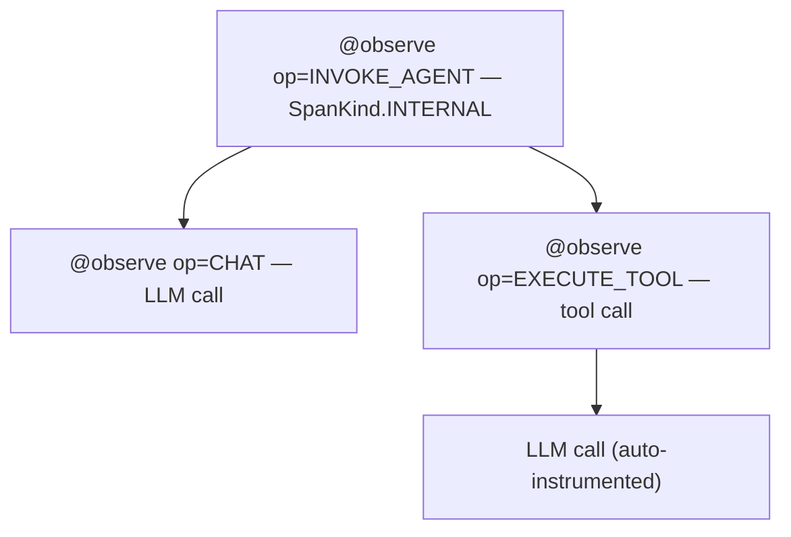

import { Aside } from '@astrojs/starlight/components';

`opensearch-genai-observability-sdk-py` instruments Python LLM applications using standard OpenTelemetry. It configures the OTEL pipeline in one call, provides a unified `observe()` primitive for tracing your application logic, and emits evaluation scores through the same OTLP exporter.

- **PyPI:** `opensearch-genai-observability-sdk-py`
- **Python:** 3.10, 3.11, 3.12, 3.13
- **Source:** [github.com/opensearch-project/genai-observability-sdk-py](https://github.com/opensearch-project/genai-observability-sdk-py)

## Installation

```bash
pip install opensearch-genai-observability-sdk-py
```

The core package includes the OTEL SDK and OTLP exporters. Auto-instrumentation for LLM providers is opt-in:

```bash
pip install "opensearch-genai-observability-sdk-py[openai]"
pip install "opensearch-genai-observability-sdk-py[anthropic]"
pip install "opensearch-genai-observability-sdk-py[bedrock]"
pip install "opensearch-genai-observability-sdk-py[langchain]"
pip install "opensearch-genai-observability-sdk-py[llamaindex]"
pip install "opensearch-genai-observability-sdk-py[otel-instrumentors]"  # all providers at once
pip install "opensearch-genai-observability-sdk-py[opensearch]"          # trace retrieval from OpenSearch
pip install "opensearch-genai-observability-sdk-py[all]"                 # everything
```

Available provider extras: `openai`, `anthropic`, `cohere`, `mistral`, `groq`, `ollama`, `google`, `bedrock`, `langchain`, `llamaindex`.

## Quick start

```python
from opensearch_genai_observability_sdk_py import register, observe, Op, enrich, score

register(endpoint="http://localhost:4318/v1/traces", service_name="my-app")

@observe(op=Op.EXECUTE_TOOL)
def get_weather(city: str) -> dict:
    """Fetch current weather for a city."""
    return {"city": city, "temp": 22, "condition": "sunny"}

@observe(op=Op.INVOKE_AGENT)
def assistant(query: str) -> str:
    enrich(model="gpt-4o", provider="openai")
    data = get_weather("Paris")
    return f"{data['condition']}, {data['temp']}C"

result = assistant("What's the weather?")
```

---

## `register()`

Configures the OTEL tracing pipeline. Call once at startup before any tracing occurs.

```python
from opensearch_genai_observability_sdk_py import register

register(
    endpoint="http://localhost:4318/v1/traces",
    service_name="my-app",
)
```

| Parameter | Type | Default | Description |
|---|---|---|---|
| `endpoint` | `str` | `http://localhost:21890/opentelemetry/v1/traces` | OTLP endpoint URL. Reads `OTEL_EXPORTER_OTLP_TRACES_ENDPOINT` or `OTEL_EXPORTER_OTLP_ENDPOINT` if not set. |
| `protocol` | `"http"` \| `"grpc"` | inferred from URL | Force transport. Inferred from scheme if omitted: `grpc://` -> gRPC, `grpcs://` -> gRPC+TLS, else HTTP. |
| `service_name` | `str` | `"default"` | Attached to all spans as `service.name`. Reads `OTEL_SERVICE_NAME`. |
| `project_name` | `str` | | Alias for `service_name`. Reads `OPENSEARCH_PROJECT`. |
| `service_version` | `str` | | Sets `service.version` resource attribute. Reads `OTEL_SERVICE_VERSION`. |
| `batch` | `bool` | `True` | `True` uses `BatchSpanProcessor` (production). `False` uses `SimpleSpanProcessor` (debugging). |
| `auto_instrument` | `bool` | `True` | Discovers and activates installed OTel instrumentor packages. |
| `exporter` | `SpanExporter` | | Custom exporter instance. Overrides `endpoint`, `protocol`, and `headers`. |
| `set_global` | `bool` | `True` | Register as the global `TracerProvider`. |
| `headers` | `dict` | | Additional HTTP headers for the OTLP exporter. |

`register()` returns the configured `TracerProvider`.

### Endpoint schemes

| URL scheme | Transport |
|---|---|
| `http://` or `https://` | OTLP HTTP (default) |
| `grpc://` | OTLP gRPC, insecure |
| `grpcs://` | OTLP gRPC with TLS |

### Examples

Self-hosted OpenSearch with a local collector:

```python
register(service_name="my-app")
# uses http://localhost:21890/opentelemetry/v1/traces by default
```

AWS OpenSearch Ingestion with SigV4:

```python
from opensearch_genai_observability_sdk_py import AWSSigV4OTLPExporter, register

exporter = AWSSigV4OTLPExporter(
    endpoint="https://pipeline.us-east-1.osis.amazonaws.com/v1/traces",
    service="osis",
    region="us-east-1",
)
register(service_name="my-app", exporter=exporter)
```

gRPC:

```python
register(endpoint="grpc://localhost:4317", service_name="my-app")
```

Custom exporter:

```python
from opentelemetry.exporter.otlp.proto.http.trace_exporter import OTLPSpanExporter

register(
    service_name="my-app",
    exporter=OTLPSpanExporter(endpoint="http://localhost:4318/v1/traces"),
)
```

---

## `observe()`

The unified tracing primitive. Works as a **decorator** (sync, async, generator, async generator) and as a **context manager**. Replaces the previous separate `@workflow`, `@agent`, `@tool`, and `@task` decorators.

### Usage forms

**Bare decorator** — uses the function's `__qualname__` as the span name:

```python
@observe
def my_function():
    ...
```

**Parameterized decorator** — set name, operation type, span kind:

```python
@observe(name="weather_agent", op=Op.INVOKE_AGENT)
def run_agent(query: str) -> str:
    ...
```

**Context manager** — for inline tracing blocks:

```python
with observe("llm_call", op=Op.CHAT) as span:
    response = llm.chat(messages)
    enrich(model="gpt-4o", input_tokens=150, output_tokens=50)
```

### Parameters

| Parameter | Type | Default | Description |
|---|---|---|---|
| `name` | `str` | function `__qualname__` or `"unnamed"` | Span entity name. |
| `op` | `str` | | Sets `gen_ai.operation.name`. When set, the span name becomes `"{op} {name}"`. Use `Op` constants or any custom string. |
| `kind` | `SpanKind` | `INTERNAL` | OTel `SpanKind`. |
| `name_from` | `str` | | Name of a function parameter whose runtime value becomes the span name. Decorator mode only. |

### `Op` constants

Use `Op` for well-known `gen_ai.operation.name` values:

| Constant | Value | Use for |
|---|---|---|
| `Op.INVOKE_AGENT` | `"invoke_agent"` | Agent invocations and orchestration |
| `Op.EXECUTE_TOOL` | `"execute_tool"` | Tool/function calls by an agent |
| `Op.CHAT` | `"chat"` | LLM chat completions |
| `Op.CREATE_AGENT` | `"create_agent"` | Agent creation/initialization |
| `Op.RETRIEVAL` | `"retrieval"` | RAG retrieval operations |
| `Op.EMBEDDINGS` | `"embeddings"` | Embedding generation |
| `Op.GENERATE_CONTENT` | `"generate_content"` | Content generation |
| `Op.TEXT_COMPLETION` | `"text_completion"` | Text completions |

Any custom string is also accepted for `op`.

### Automatic behavior

In decorator mode, `observe()` automatically:

- **Captures input** as `gen_ai.input.messages` (or `gen_ai.tool.call.arguments` for `EXECUTE_TOOL`). Skips `self`/`cls` parameters. Truncated at 10,000 characters.
- **Captures output** as `gen_ai.output.messages` (or `gen_ai.tool.call.result` for `EXECUTE_TOOL`). Does not overwrite if already set inside the function. Truncated at 10,000 characters.
- **Records errors** as span status `ERROR` with an exception event.
- **Sets entity attributes** based on `op`: `gen_ai.agent.name` for agent operations, `gen_ai.tool.name` + `gen_ai.tool.type="function"` for tool operations.

### Span hierarchy

A typical trace looks like this:



### Dispatcher pattern

When the tool name is only known at call time, use `name_from` to resolve it from a runtime argument:

```python
@observe(op=Op.EXECUTE_TOOL, name_from="tool_name")
def execute_tool(self, tool_name: str, arguments: dict) -> dict:
    """Routes calls to the appropriate tool implementation."""
    return self._tools[tool_name](**arguments)
```

Each call produces a span named `execute_tool <actual_tool_name>`.

### Async support

`observe()` transparently handles async functions:

```python
@observe(op=Op.EXECUTE_TOOL)
async def async_search(query: str) -> list[dict]:
    return await search_api.query(query)

@observe(op=Op.INVOKE_AGENT)
async def async_agent(query: str) -> str:
    results = await async_search(query)
    return summarize(results)
```

### Custom output attributes

If you set output attributes inside the function body, the decorator will not overwrite them:

```python
from opentelemetry import trace
import json

@observe(op=Op.INVOKE_AGENT, name="my_agent")
def my_agent(query: str) -> str:
    result = do_work(query)
    span = trace.get_current_span()
    span.set_attribute(
        "gen_ai.output.messages",
        json.dumps([{"role": "assistant", "content": result}])
    )
    return result
```

---

## `enrich()`

Adds GenAI semantic convention attributes to the currently active span. Call from inside `@observe`-decorated functions or `with observe(...)` blocks.

```python
from opensearch_genai_observability_sdk_py import enrich

@observe(op=Op.CHAT, name="llm_call")
def call_llm(messages: list) -> str:
    response = openai.chat.completions.create(model="gpt-4o", messages=messages)
    enrich(
        model="gpt-4o",
        provider="openai",
        input_tokens=response.usage.prompt_tokens,
        output_tokens=response.usage.completion_tokens,
        finish_reason=response.choices[0].finish_reason,
    )
    return response.choices[0].message.content
```

### Parameters

| Parameter | OTel Attribute | Type |
|---|---|---|
| `model` | `gen_ai.request.model` | `str` |
| `provider` | `gen_ai.provider.name` | `str` |
| `input_tokens` | `gen_ai.usage.input_tokens` | `int` |
| `output_tokens` | `gen_ai.usage.output_tokens` | `int` |
| `total_tokens` | `gen_ai.usage.total_tokens` | `int` |
| `response_id` | `gen_ai.response.id` | `str` |
| `finish_reason` | `gen_ai.response.finish_reasons` | `str` (stored as list) |
| `temperature` | `gen_ai.request.temperature` | `float` |
| `max_tokens` | `gen_ai.request.max_tokens` | `int` |
| `session_id` | `gen_ai.conversation.id` | `str` |
| `agent_id` | `gen_ai.agent.id` | `str` |
| `agent_description` | `gen_ai.agent.description` | `str` |
| `tool_definitions` | `gen_ai.tool.definitions` | `list[dict]` (JSON-serialized) |
| `system_instructions` | `gen_ai.system_instructions` | `str` |
| `input_messages` | `gen_ai.input.messages` | any (JSON-serialized) |
| `output_messages` | `gen_ai.output.messages` | any (JSON-serialized) |
| `**extra` | key used as-is | any |

All parameters are optional. Only provided values are set on the span.

---

## `score()`

Submits an evaluation score as an OTEL span. Scores flow through the same OTLP pipeline as traces and land in the same OpenSearch index.

```python
from opensearch_genai_observability_sdk_py import score
```

### Span-level scoring

Score a specific span — a single LLM call or tool execution:

```python
score(
    name="accuracy",
    value=0.95,
    trace_id="abc123def456...",
    span_id="789abc...",
    explanation="Answer matches ground truth",
)
```

### Trace-level scoring

Score an entire agent run (attaches to the root span):

```python
score(
    name="relevance",
    value=0.92,
    trace_id="abc123def456...",
    explanation="Response addresses the user's query",
)
```

### Standalone scoring

Score without linking to a specific trace:

```python
score(name="baseline_quality", value=0.75, label="acceptable")
```

### Parameters

| Parameter | Type | Description |
|---|---|---|
| `name` | `str` | Metric name, e.g. `"relevance"`, `"factuality"`. |
| `value` | `float` | Numeric score. |
| `trace_id` | `str` | Hex trace ID of the trace being scored. |
| `span_id` | `str` | Hex span ID for span-level scoring. When omitted with `trace_id`, attaches to the root span. |
| `label` | `str` | Human-readable label, e.g. `"pass"`, `"relevant"`. |
| `explanation` | `str` | Evaluator rationale. Truncated to 500 characters. |
| `response_id` | `str` | LLM completion ID for correlation. |
| `attributes` | `dict` | Additional span attributes (keys used as-is). |

Scores are emitted as spans with `gen_ai.evaluation.*` attributes and a `gen_ai.evaluation.result` event.

### Getting the trace ID

Read the trace ID from the active span context:

```python
from opentelemetry import trace

@observe(op=Op.INVOKE_AGENT, name="my_pipeline")
def run(query: str) -> str:
    ctx = trace.get_current_span().get_span_context()
    trace_id = format(ctx.trace_id, "032x")
    result = do_work(query)
    return result

# After run() returns, score using the captured trace_id
```

---

## AWS authentication

For AWS-hosted endpoints (OpenSearch Ingestion or OpenSearch Service), use the `AWSSigV4OTLPExporter` to sign requests with AWS SigV4.

```python
from opensearch_genai_observability_sdk_py import AWSSigV4OTLPExporter, register

exporter = AWSSigV4OTLPExporter(
    endpoint="https://pipeline.us-east-1.osis.amazonaws.com/v1/traces",
    service="osis",           # "osis" for OSIS pipelines, "es" for OpenSearch Service
    region="us-east-1",       # auto-detected from botocore if not set
)
register(service_name="my-app", exporter=exporter)
```

Credentials are resolved via the standard botocore chain: `AWS_ACCESS_KEY_ID` / `AWS_SECRET_ACCESS_KEY` env vars -> `~/.aws/credentials` -> IAM role / IMDS.

<Aside type="caution">
SigV4 + gRPC is not supported. Use `https://` (OTLP HTTP) for AWS endpoints.
</Aside>

### `AWSSigV4OTLPExporter`

| Parameter | Type | Default | Description |
|---|---|---|---|
| `endpoint` | `str` | | OTLP HTTP endpoint URL. |
| `service` | `str` | `"osis"` | AWS service name for signing. `"osis"` for OpenSearch Ingestion, `"es"` for OpenSearch Service. |
| `region` | `str` | auto | AWS region. Auto-detected from botocore if not provided. |

All other `OTLPSpanExporter` parameters are also accepted.

---

## Auto-instrumentation

`register()` discovers and activates installed instrumentor packages via OTEL entry points. Install the extra for your LLM provider and its calls are traced automatically — no code changes needed.

| Provider / framework | Extra |
|---|---|
| OpenAI, OpenAI Agents | `[openai]` |
| Anthropic | `[anthropic]` |
| Amazon Bedrock | `[bedrock]` |
| LangChain | `[langchain]` |
| LlamaIndex | `[llamaindex]` |
| Cohere | `[cohere]` |
| Mistral | `[mistral]` |
| Groq | `[groq]` |
| Ollama | `[ollama]` |
| Google Generative AI + Vertex AI | `[google]` |
| All of the above + more | `[otel-instrumentors]` |

The `[otel-instrumentors]` bundle also includes Together, Replicate, Writer, Voyage AI, SageMaker, watsonx, Haystack, CrewAI, Agno, MCP, Transformers, ChromaDB, Pinecone, Qdrant, Weaviate, Milvus, LanceDB, Marqo.

To disable auto-instrumentation:

```python
register(auto_instrument=False)
```

---

## Environment variables

| Variable | Description | Default |
|---|---|---|
| `OTEL_EXPORTER_OTLP_TRACES_ENDPOINT` | OTLP traces endpoint URL | |
| `OTEL_EXPORTER_OTLP_ENDPOINT` | OTLP endpoint URL (appends `/v1/traces`) | `http://localhost:21890/opentelemetry/v1/traces` |
| `OTEL_SERVICE_NAME` | Service name for all spans | `"default"` |
| `OPENSEARCH_PROJECT` | Project name (fallback for service name) | `"default"` |
| `OTEL_SERVICE_VERSION` | Service version resource attribute | |
| `AWS_DEFAULT_REGION` | AWS region for SigV4 | auto-detected by botocore |
| `AWS_ACCESS_KEY_ID` | AWS access key | botocore credential chain |
| `AWS_SECRET_ACCESS_KEY` | AWS secret key | botocore credential chain |

---

## Migration from `opensearch-genai-sdk-py`

If you are migrating from the previous `opensearch-genai-sdk-py` package:

| Old API | New API |
|---|---|
| `from opensearch_genai_sdk_py import ...` | `from opensearch_genai_observability_sdk_py import ...` |
| `@workflow(name="x")` | `@observe(name="x", op=Op.INVOKE_AGENT)` |
| `@task(name="x")` | `@observe(name="x")` |
| `@agent(name="x")` | `@observe(name="x", op=Op.INVOKE_AGENT)` |
| `@tool(name="x")` | `@observe(name="x", op=Op.EXECUTE_TOOL)` |
| `span.set_attribute("gen_ai.request.model", "gpt-4o")` | `enrich(model="gpt-4o")` |
| `score(..., source="llm-judge", conversation_id="...")` | `score(..., attributes={"source": "llm-judge"})` |

The `register()` function is largely the same. The `auth`, `region`, and `service` parameters for AWS have been replaced by passing an `AWSSigV4OTLPExporter` directly via the `exporter` parameter.

---

## Related links

- [Experiments & Evaluation](/docs/sdks/python-experiments/) — run evaluations, upload results, compare agent versions
- [Trace Retrieval](/docs/sdks/python-retrieval/) — query stored traces from OpenSearch
- [JavaScript SDK](/docs/sdks/javascript/) — TypeScript/Node.js equivalent
- [Agent Traces](/docs/investigate/discover-traces/) — viewing traces in OpenSearch Dashboards
- [Send Data](/docs/send-data/) — OTLP pipeline and collector setup
- [FAQ](/docs/sdks/faq/) — common questions
- [GenAI semantic conventions](https://opentelemetry.io/docs/specs/semconv/gen-ai/) — OTel spec reference
