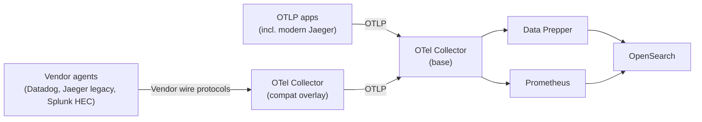

The vendor compatibility overlay adds a dedicated OpenTelemetry Collector that accepts Datadog, Jaeger, and Splunk HEC wire protocols, translates them to OTLP, and forwards to the base collector. Existing vendor agents can be reconfigured to send their telemetry to observability-stack with only an endpoint URL change — no application code changes required.

## Do I need this overlay?

| If your apps emit... | Need this overlay? |
|----------------------|--------------------|
| OpenTelemetry OTLP (gRPC or HTTP) | No. Send directly to the base collector on 4317 or 4318. |
| Jaeger via modern OpenTelemetry SDK + OTLP | No. |
| Datadog (`dd-trace-*` SDKs, DogStatsD) | Yes. |
| Jaeger native wire protocol (`jaeger-client-*`) | Yes. |
| Splunk HEC | Yes. |

SignalFx is not supported. The upstream `signalfxreceiver` was deprecated with guidance to migrate to OTLP.

## Architecture



OTLP apps bypass the compat hop and send directly to the base collector. All enrichment and downstream routing happens in the base pipeline, as it does for OTLP-native traffic.

## Enabling the overlay

Activation uses the standard `INCLUDE_COMPOSE_*` pattern used by observability-stack overlays:

```bash
echo "INCLUDE_COMPOSE_COMPAT=docker-compose.compat.yml" >> .env
docker compose up -d
```

This adds an `otel-collector-compat` service with receivers for each supported vendor, plus the bundled Jaeger `hotrod` demo for validation.

### Verify

```bash
docker compose ps otel-collector-compat
curl -sI http://localhost:8126/info  # HTTP 200 = Datadog receiver is live
```

## Supported vendors

| Vendor | Default ports | Migration guide |
|--------|---------------|-----------------|
| Datadog | 8126/tcp, 8125/udp | [Datadog](/docs/send-data/from-vendor/datadog/) |
| Jaeger (legacy wire protocol) | 14250/tcp, 14268/tcp | [Jaeger](/docs/send-data/from-vendor/jaeger/) |
| Splunk HEC | 8088/tcp | [Splunk HEC](/docs/send-data/from-vendor/splunk/) |

## Port customization

Default ports are remappable via environment variables. Useful when a real vendor agent already occupies the default port on the host.

| Variable | Default | Maps to |
|----------|---------|---------|
| `COMPAT_DATADOG_APM_PORT` | 8126 | Datadog trace-agent |
| `COMPAT_DATADOG_STATSD_PORT` | 8125 | DogStatsD |
| `COMPAT_JAEGER_GRPC_PORT` | 14250 | Jaeger gRPC |
| `COMPAT_JAEGER_THRIFT_HTTP_PORT` | 14268 | Jaeger Thrift HTTP |
| `COMPAT_SPLUNK_HEC_PORT` | 8088 | Splunk HEC |
| `COMPAT_COLLECTOR_MEMORY_LIMIT` | 256M | Compat collector memory limit |

## Attribute translation

Each receiver translates vendor-specific data to the OpenTelemetry data model. Translation behavior is defined by the upstream receivers. See each per-vendor guide for canonical attribute mappings, and:

- Upstream receiver READMEs under [`opentelemetry-collector-contrib`](https://github.com/open-telemetry/opentelemetry-collector-contrib/tree/main/receiver)
- Each vendor's own instrumentation and tagging documentation

## Viewing ingested data

Once data reaches OpenSearch:

- **Traces** — [APM](/docs/apm/) for service maps and RED metrics, or [Discover Traces](/docs/investigate/discover-traces/) for trace-level exploration
- **Logs** — [Discover Logs](/docs/investigate/discover-logs/) (default index pattern: `logs-otel-v1-*`)
- **Metrics** — [Discover Metrics](/docs/investigate/discover-metrics/) (via Prometheus datasource)
